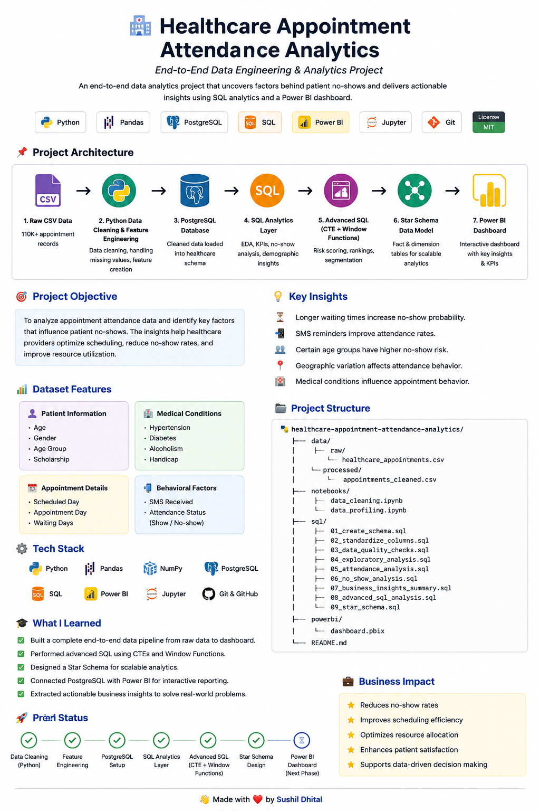

# 🏥 Healthcare Appointment Attendance Analytics

<p align="center">
  
  
  
  
</p>

---

## 🚀 Project Summary

A complete **end-to-end data engineering and analytics project** analyzing **110,000+ healthcare appointments** to uncover patterns behind patient no-shows and improve hospital efficiency.

This project demonstrates:
- Data Cleaning & Feature Engineering (Python)
- Data Warehousing (PostgreSQL Star Schema)
- Advanced SQL Analytics (CTEs + Window Functions)
- Business Intelligence Readiness (Power BI)

---

## 🎯 Business Problem

Missed appointments cause:
- ⏳ Wasted doctor availability
- 🏥 Poor hospital resource utilization
- 📉 Increased patient waiting time
- 💰 Financial inefficiencies

👉 Goal: Identify **what drives no-shows and how to reduce them**

---

## 🧱 End-to-End Architecture



```text
Raw CSV Data
   ↓
Python Data Cleaning & Feature Engineering
   ↓
Cleaned Dataset
   ↓
PostgreSQL (Healthcare Schema)
   ↓
SQL Analytics Layer
   ↓
Advanced SQL (CTEs + Window Functions)
   ↓
Star Schema Data Warehouse
   ↓
Power BI Dashboard
```

---

## 📊 Key Insights

- 📌 Longer waiting times significantly increase no-show probability
- 📌 SMS reminders improve attendance rates
- 📌 Age groups show distinct behavioral patterns
- 📌 Certain neighbourhoods have higher risk of missed appointments
- 📌 Medical conditions influence attendance behavior

---

## 🗄️ Data Warehouse Design (Star Schema)

### ⭐ Fact Table
- fact_appointments

### 📌 Dimensions
- dim_patient
- dim_location
- dim_conditions
- dim_date

👉 Enables scalable analytics and BI integration

---

## ⚙️ Tech Stack

- Python (Pandas, NumPy, Matplotlib, Seaborn)
- PostgreSQL
- SQL (CTEs, Window Functions, Aggregations)
- Jupyter Notebook
- Power BI
- Git & GitHub

---

## 📁 Project Structure

```text
healthcare-appointment-attendance-analytics/
├── data/
├── notebooks/
├── sql/
│   ├── 01_create_schema.sql
│   ├── 02_standardize_columns.sql
│   ├── 03_data_quality_checks.sql
│   ├── 04_exploratory_analysis.sql
│   ├── 05_attendance_analysis.sql
│   ├── 06_no_show_analysis.sql
│   ├── 07_business_insights_summary.sql
│   ├── 08_advanced_sql_analysis.sql
│   └── 09_star_schema.sql
├── powerbi/
├── README.md
```

---

## 🧠 Skills Demonstrated

✔ Data Engineering Pipeline Design  
✔ SQL Analytics (Advanced Level)  
✔ Data Warehousing (Star Schema)  
✔ Business Insight Generation  
✔ End-to-End Project Structuring  

---

## 📌 Project Status

🟢 Completed Core Data Pipeline  
🟢 Completed SQL Analytics Layer  
🟢 Completed Advanced SQL (CTE + Window Functions)  
🟢 Completed Star Schema Design  
🟢 Completed Power BI Dashboard

---

## 👨‍💻 Author

**Sushil Dhital**  
Aspiring Data Engineer | SQL | Python | Analytics | BI